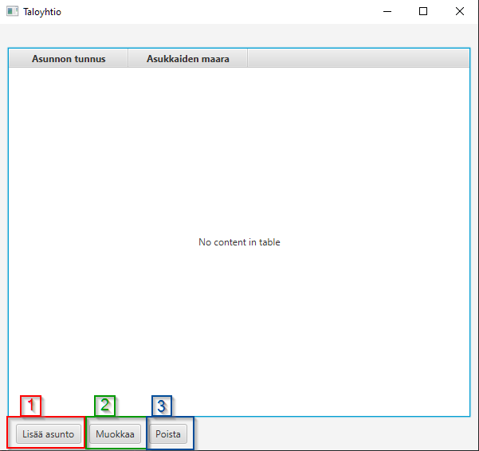
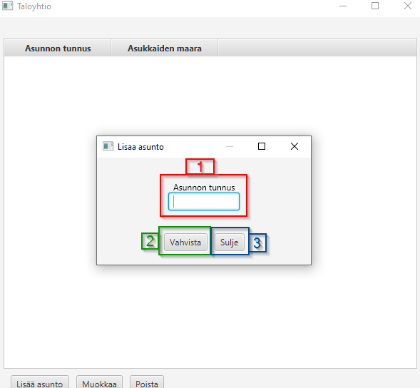
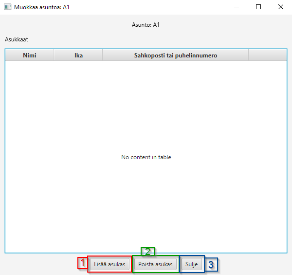
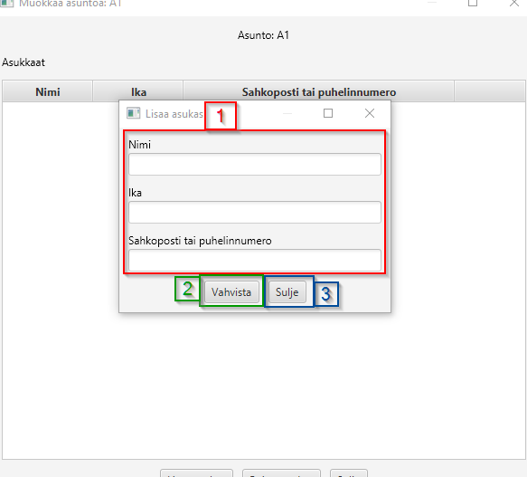

# HuoneistoFX
Tämä sovellus on JavaFX:llä toteutettu sovellus taloyhtiön hallintaan.

Sovelluksella voi hallita:

- asuntoja
- asukkaita
- tietojen tallennusta JSON tiedostoon

# Toiminnallisuudet

## Taloyhtiön hallinta

### 1. Lisää asunto taloyhtiöön
### 2. Muokkaa valittua asuntoa
### 3. Poista valittu asunto

## Asunnon lisäys

### 1. Kirjoita asunnon tunnus
### 2. Vahvista lisääminen
### 3. Kun olet valmis, sulje lisäämisikkuna

## Asunnon muokkaus

### 1. Lisää asukas asuntoon
### 2. Poista valittu asukas
### 3. Kun olet valmis, sulje muokkausikkuna

## Asukkaan lisääminen

### 1. Täytä asukkaan tiedot (tiedot validoidaan, joten muista antaa kelvolliset)
### 2. Lisää asukas tietoineen
### 3. Kun olet valmis, sulje lisäämisikkuna